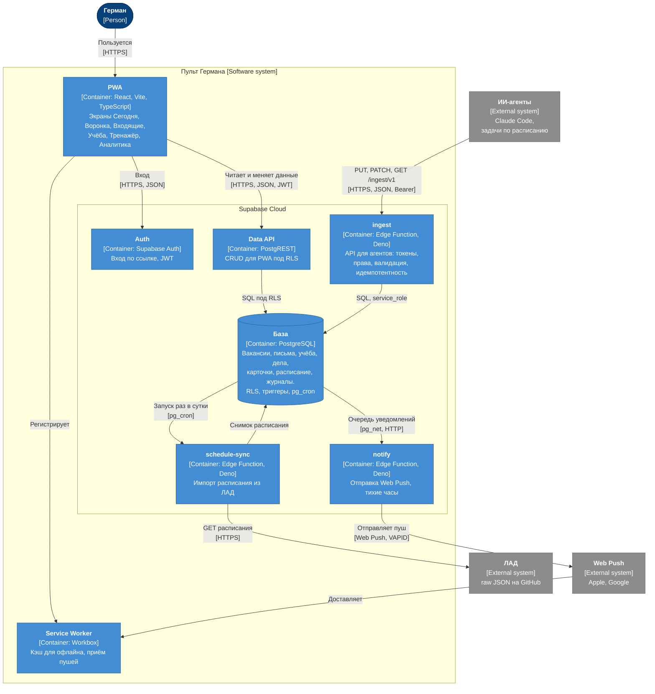

# C4, уровень 2: контейнеры

Из каких разворачиваемых частей состоит пульт и как они общаются.

Картинка: [img/c4-containers.png](../img/c4-containers.png).

## Контейнеры

| Контейнер | Технология | Отвечает за | Кто вызывает |
| --- | --- | --- | --- |
| PWA | React, Vite, TypeScript, vite-plugin-pwa | Интерфейс, расчёт недели и пар на клиенте, офлайн-кэш | Герман |
| Service Worker | Workbox | Кэш статики и последних данных, приём и показ пушей | браузер |
| Auth | Supabase Auth | Вход по одноразовой ссылке, выдача JWT, регистрация выключена | PWA |
| Data API | PostgREST (часть Supabase) | Чтение и запись таблиц с JWT пользователя, доступ режет RLS | PWA |
| ingest | Supabase Edge Function (Deno, TypeScript) | API для агентов по [OpenAPI](../05-api/openapi.yaml): токены, права, схемы, идемпотентность, If-Match, журнал запусков | агенты |
| notify | Supabase Edge Function | Выборка очереди `notification`, тихие часы, отправка Web Push, отметка результата | триггер через `pg_net` |
| schedule-sync | Supabase Edge Function | Раз в сутки забирает JSON расписания из ЛАД, сравнивает хэш, пишет снимок | `pg_cron` |
| База | PostgreSQL в Supabase | Данные, ограничения, триггеры истории и очереди, RLS | Data API, функции |

## Почему два входа в базу

PWA ходит через Data API с JWT Германа, и права проверяет Postgres политиками RLS. Агенты ходят через `ingest` со своими токенами. Ключ `service_role`, который обходит RLS, есть только у Edge Functions. Подробности в [ADR-003](../06-decisions/ADR-003-agent-ingest-api.md).

## Расчёт пар на клиенте

Снимок расписания хранится как JSON (`schedule_snapshot.payload`). Какая сейчас неделя, числитель или знаменатель и какие пары активны, считает PWA по тем же правилам, что ЛАД. Так расписание работает офлайн и не нужен отдельный запрос на каждый день. Решение в [ADR-004](../06-decisions/ADR-004-schedule-snapshot.md).
