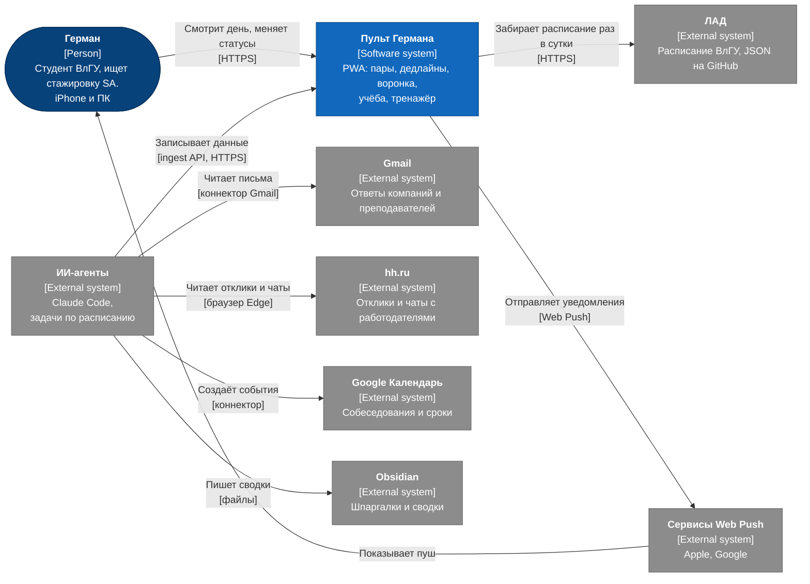

# C4, уровень 1: контекст системы

Кто пользуется пультом и с какими внешними системами он связан. Нотация C4: синий человек, синяя наша система, серые внешние системы. На стрелках действие и технология в квадратных скобках.

Картинка: [img/c4-context.png](../img/c4-context.png).

## Пояснения

| Элемент | Роль | Почему так |
| --- | --- | --- |
| ИИ-агенты | Единственный путь данных из почты и hh.ru в пульт | Пульт не хранит пароли и токены почты. Доступ к Gmail есть только у коннектора Claude, у hh.ru нет открытого API откликов для соискателя |
| Gmail | Один основной ящик | Второй, старый ящик пересылает письма в основной, второй интеграции не нужно |
| ЛАД | Источник расписания | Расписание уже собирается и проверяется в проекте ЛАД, пульт берёт готовый JSON и не парсит сайт ВлГУ сам |
| Web Push | Основной канал уведомлений | Telegram в РФ в 2026 году почти полностью заблокирован, см. [ADR-002](../06-decisions/ADR-002-notifications.md) |
| Google Календарь, Obsidian | Остаются у агентов как раньше | Пульт их не дублирует, в карточке вакансии есть ссылка на заметку |

Чего на схеме нет специально: пульт ничего не отправляет компаниям и преподавателям. Стрелок от пульта к Gmail и hh.ru нет.
