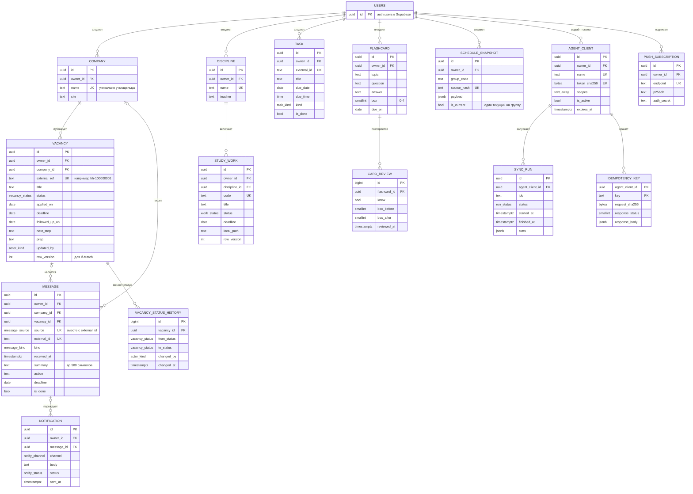

# ER-модель

Логическая модель данных пульта. Физическая схема с типами, ограничениями, триггерами и RLS лежит в [schema.sql](schema.sql). Схема проверена на PostgreSQL 18.6, тесты в [tests/](tests/).



Картинка: [img/er-model.png](../img/er-model.png).

## Сущности

| Таблица | Что хранит | Ключ для агентов | Особенности |
| --- | --- | --- | --- |
| `company` | Компании-работодатели | `name` у владельца | Создаётся автоматически при записи вакансии или письма |
| `vacancy` | Вакансии и этап отбора | `external_ref`, например `hh-100000001` | `row_version` для If-Match, `updated_by` кто менял последним. Для всех статусов, кроме `found` и `skip`, обязательна дата подачи |
| `vacancy_status_history` | История смены статусов | нет | Пишется триггером, по ней считается скорость ответа компаний |
| `message` | Ответы компаний: суть, действие, срок | `source` + `external_id` | Полный текст письма не хранится, `summary` до 500 символов |
| `notification` | Очередь и журнал пушей | нет | Строку ставит триггер на `message` для типов invite, test, offer, question |
| `discipline` | Учебные предметы и преподаватели | `name` | |
| `study_work` | Лабы, курсовые, ДЗ | `code`, например `ib-lr2` | `row_version`, статусы todo, doing, ready, submitted |
| `task` | Дела со сроком: платежи, записи, личное | `external_id` | Дела, созданные вручную, живут без ключа |
| `flashcard` | Карточки тренажёра | нет, повтор через `Idempotency-Key` | Коробка 0-4 и дата следующего повтора |
| `card_review` | История ответов «знаю» и «не знаю» | нет | По ней считается метрика K6 |
| `schedule_snapshot` | Снимки расписания из ЛАД | `group_code` + `source_hash` | Один текущий снимок на группу (частичный уникальный индекс) |
| `agent_client` | Агенты и их токены | `name` | Хранится только SHA-256 токена, права в `scopes` |
| `sync_run` | Журнал запусков агентов | нет | По нему шапка показывает «обновлено ЧЧ:ММ» |
| `idempotency_key` | Сохранённые ответы на повторные POST | `agent_client_id` + `key` | Живёт 24 часа, чистится `pg_cron` |
| `push_subscription` | Подписки устройств на Web Push | `endpoint` | |

## Решения по модели

1. **`owner_id` во всех бизнес-таблицах.** Пользователь сейчас один, но RLS строится по этому полю. Когда появится многопользовательский режим (v2.0), схема не меняется.
2. **Естественные ключи для идемпотентности.** Агент повторяет запрос после сбоя, и дубль не появляется: уникальность на `(owner_id, source, external_id)` у писем и `(owner_id, external_ref)` у вакансий.
3. **Версия строки вместо сравнения по времени.** `row_version` растёт на каждый UPDATE (триггер `touch_row`). API отдаёт её как ETag, агент присылает в `If-Match`.
4. **История статусов триггером.** Логику нельзя обойти ни из PWA, ни из API. Триггер работает как `security definer`: у пользователя есть право только читать историю.
5. **Расписание снимком JSON.** Структура пар (числитель, знаменатель, диапазоны недель, подгруппы) целиком приходит из ЛАД, и нормализовать её в таблицы нет смысла, см. [ADR-004](../06-decisions/ADR-004-schedule-snapshot.md).

## Что проверено на реальной базе

Тесты запускались на временном кластере PostgreSQL 18.6 с заглушкой схемы `auth` из Supabase.

| Проверка | Результат |
| --- | --- |
| Схема применяется без ошибок | да |
| История статусов пишется при вставке и смене статуса, с автором | да |
| `row_version` растёт на UPDATE | да |
| Письмо-приглашение ставит пуш в очередь, автоответ не ставит | да |
| Вакансия в статусе applied без даты подачи отклоняется | да |
| Дубль письма по `source` + `external_id` отклоняется | да |
| Коробка карточки вне 0-4 отклоняется | да |
| Второй текущий снимок расписания группы отклоняется | да |
| Пользователь B не видит данных A и не может писать от имени A | да |
| Герман меняет статус и добавляет письмо под своей ролью | да, после исправления: первая версия падала на RLS в триггере истории |

Как повторить:

```bash
psql -d pult -f tests/00_supabase_stub.sql -f schema.sql
psql -d pult -f tests/10_constraints_triggers_rls.sql
psql -d pult -f tests/20_owner_flow.sql
```
