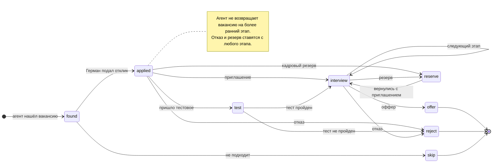
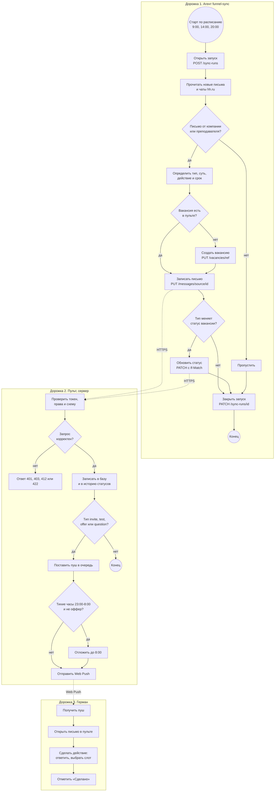
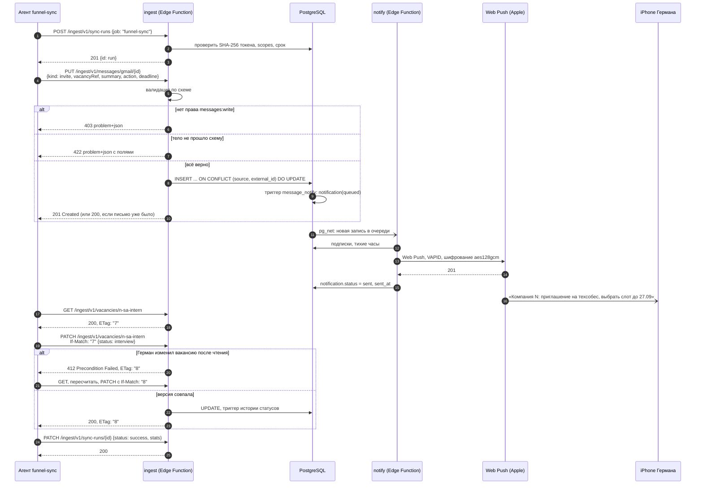

# Процессы

## 1. Жизненный цикл вакансии

Картинка: [img/vacancy-states.png](../img/vacancy-states.png).

| Переход | Кто делает | Откуда узнаём |
| --- | --- | --- |
| found → applied | Герман | подал отклик сам |
| applied → test, interview, reject, reserve | агент или Герман | письмо, статус на hh.ru, сообщение Германа |
| test → interview, reject | агент или Герман | письмо с результатом теста |
| interview → offer, reject, reserve | агент или Герман | письмо |
| любой → более ранний этап | только Герман | ручная правка, API отвечает агенту 422 `status-downgrade` |

## 2. Обработка ответа работодателя

Схема процесса по дорожкам: агент, сервер пульта, Герман. Нарисована в Mermaid в стиле BPMN: круги это события, ромбы это шлюзы «или», пунктир это сообщения между участниками.

Картинка: [img/process-message.png](../img/process-message.png).

Бизнес-правила процесса:

- **БП-1.** Письмо относится к поиску работы, если отправитель это компания из воронки, HR-платформа (hh.ru, Хабр Карьера, FutureToday) или в письме есть название вакансии.
- **БП-2.** Тип `reject` ставится только при явном отказе. При сомнении ставится `info` (см. PRD, раздел 3.2).
- **БП-3.** Письмо без найденной вакансии создаёт вакансию со статусом `applied`, если в письме видно, что отклик был, иначе письмо сохраняется без привязки.
- **БП-4.** Тихие часы 23:00-8:00 по Москве. Оффер приходит сразу, остальное утром.
- **БП-5.** Агент ничего не отвечает компании. Действие в поле `action` делает Герман.

## 3. Последовательность: запись письма агентом

Картинка: [img/sequence-message.png](../img/sequence-message.png).

Что показывает диаграмма:

- шаги 1-3: агент открывает запуск, сервер проверяет токен по SHA-256, права и срок;
- ветки `alt`: 403 без права, 422 при ошибке схемы, иначе upsert по естественному ключу;
- асинхронная часть: триггер ставит уведомление, `pg_net` будит `notify`, пуш уходит через сервис Apple;
- оптимистичная блокировка: если Герман поменял вакансию после чтения агентом, агент получает 412 и повторяет с новой версией.
